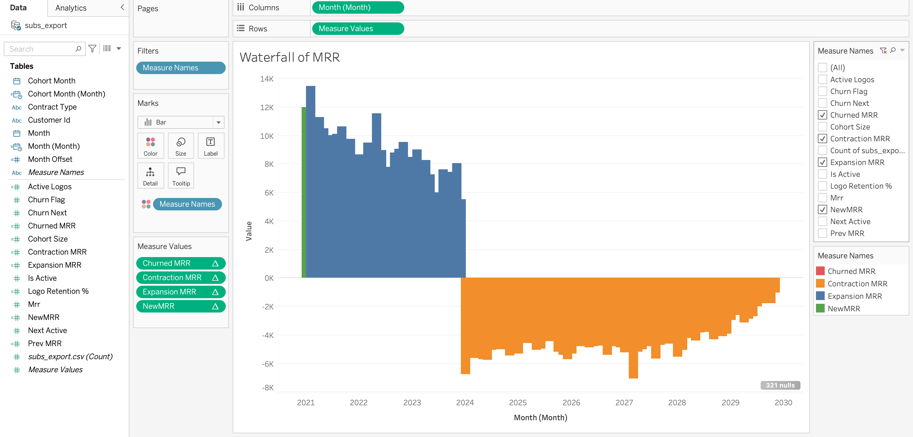
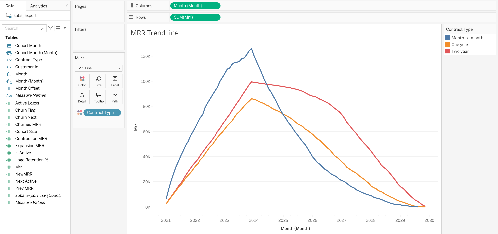
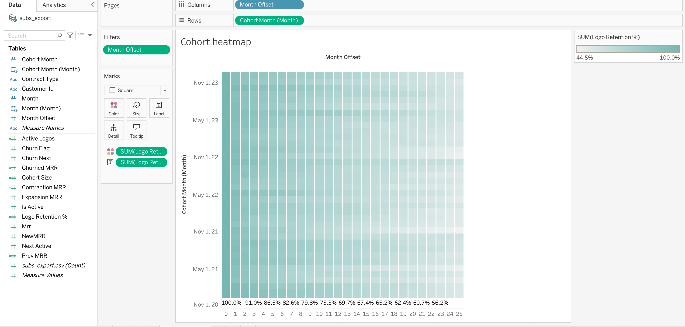

# 🌟 SaaS Subscription Revenue Retention Analysis  

<p align="center">
  
  
  
  
</p>

<p align="center">
  Python 🐍 + PostgreSQL 🐘 + Docker 🐳 + Tableau 📊
</p>


---

## 🚨 The Problem  

💡 Imagine you run a SaaS business:  
- Customers sign up, pay monthly → then… vanish ❌  
- 📉 Revenue drops, churn eats growth, and CFOs panic.  

The **big question**:  
👉 *How do we measure churn, cohorts, and retention to stop revenue leaks?*  

---

## 💡 The Solution  

I built a **full-stack analytics pipeline** that answers those exact questions:

🔹 **Dockerized PostgreSQL** — portable database, no messy installs.  
🔹 **SQL Cohort Analysis** — logo & revenue retention across time.  
🔹 **Python (Jupyter)** — preprocessing, feature engineering, exports.  
🔹 **Tableau Dashboards** — *executive-ready* visual storytelling.  


---

## 🛠️ Tech Superpowers  

| Tool | Why it Matters |
|------|----------------|
| 🐳 **Docker** | Portable, reproducible DB anywhere |
| 🐘 **PostgreSQL** | Crunch cohorts, retention, churn logic |
| 🐍 **Python** | Preprocessing, automation, churn modeling |
| 📊 **Tableau** | Insights for executives, not just analysts |

---

## 📂 Project Blueprint  

```bash
subscription-revenue-retention/
│── data/             # raw dataset (Telco CSV)
│── notebooks/        # Python notebooks (Jupyter)
│── sql/postgres/     # SQL: schema, cohorts, retention, MRR
│── exports/          # CSVs → Tableau
│── tableau/          # Packaged workbook (.twbx) or public link
│── screenshots/      # Dashboards 📸
│── README.md         # 👋 you are here

---

## 🎨 Dashboards

| 💧 Waterfall of MRR | 📈 MRR Trend | 🔥 Cohort Heatmap |
|---|---|---|
|  |  |  |

---

## ⚡ Key Insights
- Baseline churn ~ **4% monthly** (≈ **200** customers lost)
- **10%** churn reduction saves ~ **20** customers/month
- With **Avg MRR = $300** and ~ **6 months** retained → **≈ $36,000** revenue preserved

> Retention isn’t optional—it’s a **growth multiplier**.

---

## 🐳 Reproduce (Docker + Makefile)

```bash
# 1) Start Dockerized Postgres
make db-start

# 2) Create DB, tables, and load CSV
make load

# 3) Run analytics (cohorts, revenue retention, MRR movements)
make all

# 4) Export CSVs for Tableau
make exports
make copy-exports

# 5) Open the Tableau workbook (macOS)
open tableau/Subscription_Retention.twbx


